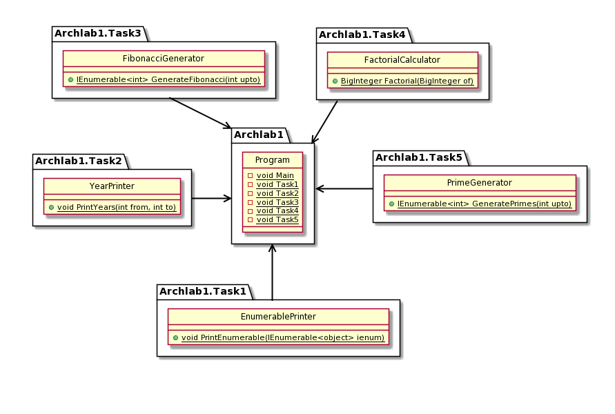

# Описание модулей

- Модуль `Archlab1.Task1` содержит статический класс `EnumerablePrinter`, содержащий метод `static void PrintEnumerable(IEnumerable<object> ienum)`, который выводит каждый элемент параметра в консоль.
- Модуль `Archlab1.Task2` содержит статический класс `YearPrinter`, содержащий метод `static void PrintYears(int from, int to)`, который выводит числа от from до to и после каждого числа пишет, является ли год високосным по григорианскому календарю.
- Модуль `Archlab1.Task3` содержит статический класс `FibonacciGenerator`, содержащий метод `static IEnumerable<int> GenerateFibonacci(int upto)`, который возвращает последовательность из всех чисел Фибоначи до заданного.
- Модуль `Archlab1.Task4` содержит статический класс `FactorialCalculator`, содержащий метод `static BigInteger Factorial(BigInteger of)`, который возвращает факториал числа.
- Модуль `Archlab1.Task5` содержит статический класс `PrimeGenerator`, содержащий метод `static IEnumerable<int> GeneratePrimes(int upto)`, который возвращает все простые числа, не превышающие заданное.
- Модуль `Archlab1` отвечает за получение ввода от пользователя и вызов функций из остальных модулей

# Контрольные вопросы
1. Архитектура программной системы – ее организационная структура, включающая модули, их внешние характеристики, а также отношения между модулями.
2. Клиент-сервер; многоуровневая; компонентная; объектно-ориентированная; сервисно-ориентированная; архитектура, основанная на шине сообщений.
3. Разделение программы на отдельные модули, выполняющие определённые функции и имеющие как можно меньше зависимостей между собой.
4. Кросплатформенность, работа в виртуальной машине, объектно-ориентированность, поддержка нескольких языков программирования.
5. Исходный код проекта компилируется в байт-код и запускается в виртуальной машине.